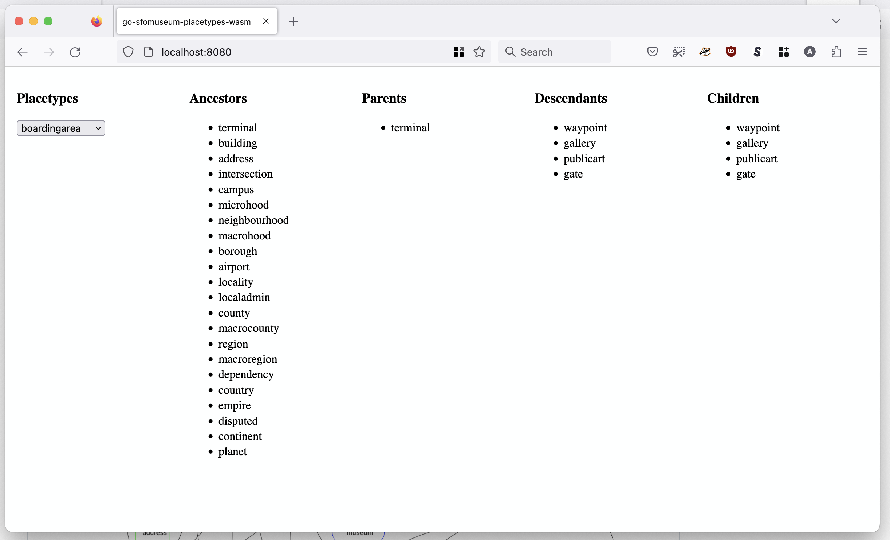

# go-sfomuseum-placetypes-wasm

Go package for compiling methods from the [go-sfomuseum-placetypes](https://github.com/sfomuseum/go-sfomuseum-placetypes) package to a JavaScript-compatible WebAssembly (wasm) binary. It also provides a net/http middleware packages for appending the necessary static assets and HTML resources to use the wasm binary in web applications.

## Important

This is work in progress

## Example

There is a full working example of this application in the `cmd/example` folder. To run this application type the following command:

```
$> make example
go run -mod vendor cmd/example/main.go
2023/01/31 15:11:48 Listening for requests on localhost:8080
```

Then open `http://localhost:8080` in a  web browser. You should see something like this:



## See also

* https://github.com/sfomuseum/sfomuseum-placetypes
* https://github.com/sfomuseum/go-sfomuseum-placetypes

* https://github.com/whosonfirst/go-whosonfirst-placetypes
* https://github.com/whosonfirst/go-whosonfirst-placetypes-wasm